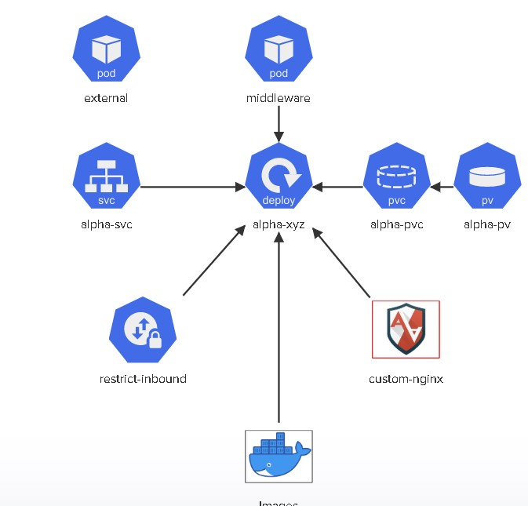

# CKS PRATICE EXAM-1 LAB

There are 6 images listed in the diagram on the right. Using Aquasec Trivy (which is already installed on 
the controlplane node), identify the image that has the least number of critical vulnerabilities and 
use it to deploy the alpha-xyz deployment.

Secure this deployment by enforcing the AppArmor profile called custom-nginx.

Expose this deployment with a NodePort type service and make sure that 
only incomings connections from the pod called middleware is accepted and 
everything else is rejected.

Click on each icon to see more details. Once done, click the Check button to test your work.



Task of external pod:

- Pod called 'external' is already deployed in the 'alpha' namespace. Inspect it but do not alter it in anyway!
'external' pod should NOT be able to connect to 'alpha-svc' on port 80

Task of middleware pod: 

- Pod called 'middleware' is already deployed in the 'alpha' namespace. Inspect it but do not alter it in anyway!


Task of alpha-svc service: 

- Expose the 'alpha-xyz' as a 'ClusterIP' type service called 'alpha-svc'

- 'alpha-svc' should be exposed on 'port: 80' and 'targetPort: 80'


Task of aplha-xyz deployment:

- Create a deployment called 'alpha-xyz' that uses the image with the least 'CRITICAL' vulnerabilities? (Use the sample YAML file located at '/root/alpha-xyz.yaml' to create the deployment. Please make sure to use the same names and labels specified in this sample YAML file!)


Task of alpha-pvc persistentvolumeclaim:

- 'alpha-pvc' should be bound to 'alpha-pv'. Delete and Re-create it if necessary.


Task of alpha-pv persistentvolume:

- A persistentVolume called 'alpha-pv' has already been created. Do not modify it and inspect the parameters used to create it.


Task of restrict-inbound NetworkPolicy: 

- Create a NetworkPolicy called 'restrict-inbound' in the 'alpha' namespace
- Policy Type = 'Ingress'
- Inbound access only allowed from the pod called 'middleware' with label 'app=middleware'
- Inbound access only allowed to TCP port 80 on pods matching the policy


Task of docker image using trivy:

- Permitted images are: 'nginx:alpine', 'bitnami/nginx', 'nginx:1.13', 'nginx:1.17', 
'nginx:1.16'and 'nginx:1.14'. Use 'trivy' to find the image with the least number of 'CRITICAL' vulnerabilities.


Task of AppArmor :

- Move the AppArmor profile '/root/usr.sbin.nginx' to '/etc/apparmor.d/usr.sbin.nginx' on the controlplane node
- Load the 'AppArmor` profile called 'custom-nginx' and ensure it is enforced.

Solution:

1. Verify persistentvolume named alpha-pv.
```
root@controlplane ~ ➜  kubectl get pv
NAME       CAPACITY   ACCESS MODES   RECLAIM POLICY   STATUS   CLAIM             STORAGECLASS    REASON   AGE
alpha-pv   1Gi        RWX            Delete           Bound    alpha/alpha-pvc   local-storage            9m7s
```

2. Let's quick check on exiting persistentvolumeclaim under alpha namespace (the problem because PV RWX but PVC but RWO).
```
root@controlplane ~ ✖ kubectl get pvc -n alpha
NAME        STATUS    VOLUME   CAPACITY   ACCESS MODES   STORAGECLASS    AGE
alpha-pvc   Pending                                      local-storage   9m7s

root@controlplane ~ ✖ kubectl describe pvc alpha-pvc -n alpha
Name:          alpha-pvc
Namespace:     alpha
StorageClass:  local-storage
Status:        Pending
Volume:        
Labels:        <none>
Annotations:   <none>
Finalizers:    [kubernetes.io/pvc-protection]
Capacity:      
Access Modes:  
VolumeMode:    Filesystem
Used By:       <none>
Events:
  Type     Reason              Age                  From                         Message
  ----     ------              ----                 ----                         -------
  Warning  ProvisioningFailed  7s (x10 over 2m11s)  persistentvolume-controller  storageclass.storage.k8s.io "local-storage" not found

```


3. Get yaml manifest file  of alpha-pvc 
```
root@controlplane ~ ➜  kubectl get pvc alpha-pvc -n alpha -o yaml
apiVersion: v1
kind: PersistentVolumeClaim
metadata:
  annotations:
    kubectl.kubernetes.io/last-applied-configuration: |
      {"apiVersion":"v1","kind":"PersistentVolumeClaim","metadata":{"annotations":{},"name":"alpha-pvc","namespace":"alpha"},"spec":{"accessModes":["ReadWriteOnce"],"resources":{"requests":{"storage":"1Gi"}},"storageClassName":"local-storage"}}
  creationTimestamp: "2022-09-22T05:16:15Z"
  finalizers:
  - kubernetes.io/pvc-protection
  name: alpha-pvc
  namespace: alpha
  resourceVersion: "16159"
  uid: b15e2f61-1077-406d-95eb-b2c4f2603e65
spec:
  accessModes:
  - ReadWriteOnce
  resources:
    requests:
      storage: 1Gi
  storageClassName: local-storage
  volumeMode: Filesystem
status:
  phase: Pending


root@controlplane ~ ➜  kubectl get pvc alpha-pvc -n alpha -o yaml > alpha-pvc.yaml


root@controlplane ~ ➜  vi alpha-pvc.yaml  ==> change it ReadWriteOnce to ReadWriteMany
```

4. Delete pvc and create using new PVC YAML manifest file. After create lets check it the PVC you created before

```
root@controlplane ~ ➜  kubectl -n alpha delete pvc alpha-pvc --force --grace-period=0
warning: Immediate deletion does not wait for confirmation that the running resource has been terminated. The resource may continue to run on the cluster indefinitely.
persistentvolumeclaim "alpha-pvc" force deleted

root@controlplane ~ ➜  kubectl apply -f alpha-pvc.yaml 
persistentvolumeclaim/alpha-pvc created

root@controlplane ~ ➜  kubectl get pvc -n alpha
NAME        STATUS   VOLUME     CAPACITY   ACCESS MODES   STORAGECLASS    AGE
alpha-pvc   Bound    alpha-pv   1Gi        RWX            local-storage   2m23s

```


5.  AppArmor is  is a Linux kernel security module that supplements the standard Linux user and group based permissions to confine programs to a limited set of resources. AppArmor can be configured for any application to reduce its potential attack surface and provide greater in-depth defense

```
root@controlplane ~ ➜  mv /root/usr.sbin.nginx /etc/apparmor.d/

root@controlplane ~ ➜  ls -al /etc/apparmor.d/ | grep -i nginx
-rw-rw-rw-   1 root root  1307 Sep  22 17:04 usr.sbin.nginx

root@controlplane ~ ✖ apparmor_status
apparmor module is loaded.
56 profiles are loaded.
19 profiles are in enforce mode.
   /sbin/dhclient
   /usr/bin/lxc-start
   /usr/bin/man
   /usr/lib/NetworkManager/nm-dhcp-client.action
   /usr/lib/NetworkManager/nm-dhcp-helper
   /usr/lib/chromium-browser/chromium-browser//browser_java
   /usr/lib/chromium-browser/chromium-browser//browser_openjdk
   /usr/lib/chromium-browser/chromium-browser//sanitized_helper
   /usr/lib/connman/scripts/dhclient-script
   /usr/lib/snapd/snap-confine
   /usr/lib/snapd/snap-confine//mount-namespace-capture-helper
   /usr/sbin/tcpdump
   docker-default
   lxc-container-default
   lxc-container-default-cgns
   lxc-container-default-with-mounting
   lxc-container-default-with-nesting
   man_filter
   man_groff
37 profiles are in complain mode.
   /usr/lib/chromium-browser/chromium-browser
   /usr/lib/chromium-browser/chromium-browser//chromium_browser_sandbox
   /usr/lib/chromium-browser/chromium-browser//lsb_release
   /usr/lib/chromium-browser/chromium-browser//xdgsettings
   /usr/lib/dovecot/anvil
   /usr/lib/dovecot/auth
   /usr/lib/dovecot/config
   /usr/lib/dovecot/deliver
   /usr/lib/dovecot/dict
   /usr/lib/dovecot/dovecot-auth
   /usr/lib/dovecot/dovecot-lda
   /usr/lib/dovecot/dovecot-lda///usr/sbin/sendmail
   /usr/lib/dovecot/imap
   /usr/lib/dovecot/imap-login
   /usr/lib/dovecot/lmtp
   /usr/lib/dovecot/log
   /usr/lib/dovecot/managesieve
   /usr/lib/dovecot/managesieve-login
   /usr/lib/dovecot/pop3
   /usr/lib/dovecot/pop3-login
   /usr/lib/dovecot/ssl-params
   /usr/sbin/avahi-daemon
   /usr/sbin/dnsmasq
   /usr/sbin/dnsmasq//libvirt_leaseshelper
   /usr/sbin/dovecot
   /usr/sbin/identd
   /usr/sbin/mdnsd
   /usr/sbin/nmbd
   /usr/sbin/nscd
   /usr/sbin/smbd
   /usr/sbin/smbldap-useradd
   /usr/sbin/smbldap-useradd///etc/init.d/nscd
   /usr/{sbin/traceroute,bin/traceroute.db}
   klogd
   ping
   syslog-ng
   syslogd
16 processes have profiles defined.
16 processes are in enforce mode.
   docker-default (2277) 
   docker-default (2295) 
   docker-default (2298) 
   docker-default (2312) 
   docker-default (2394) 
   docker-default (2468) 
   docker-default (2513) 
   docker-default (2530) 
   docker-default (3982) 
   docker-default (4017) 
   docker-default (4383) 
   docker-default (4421) 
   docker-default (14519) 
   docker-default (14543) 
   docker-default (14750) 
   docker-default (14803) 
0 processes are in complain mode.
0 processes are unconfined but have a profile defined.
```


6. Load custom nginx to apparmor
```
apparmor_parser /etc/apparmor.d/usr.sbin.nginx
```

7. Scan image with severity CRITICAL

SELFNOTES SEVERITY IN TRIVY : LOW,MEDIUM,HIGH,CRITICAL and we can use range of severity like this :
trivy image --severity HIGH,CRITICAL bitnami/nginx

```
root@controlplane ~ ➜  trivy image --severity CRITICAL nginx:alpine
2022-09-23T10:08:58.741Z        WARN    This OS version is not on the EOL list: alpine 3.16
2022-09-23T10:08:58.742Z        INFO    Detecting Alpine vulnerabilities...
2022-09-23T10:08:58.751Z        INFO    Trivy skips scanning programming language libraries because no supported file was detected
2022-09-23T10:08:58.752Z        WARN    This OS version is no longer supported by the distribution: alpine 3.16.2
2022-09-23T10:08:58.752Z        WARN    The vulnerability detection may be insufficient because security updates are not provided

nginx:alpine (alpine 3.16.2)
============================
Total: 0 (CRITICAL: 0)


root@controlplane ~ ➜  trivy image --severity CRITICAL bitnami/nginx
2022-09-23T10:09:31.161Z        WARN    You should avoid using the :latest tag as it is cached. You need to specify '--clear-cache' option when :latest image is changed
2022-09-23T10:09:31.174Z        INFO    Detecting Debian vulnerabilities...
2022-09-23T10:09:31.197Z        INFO    Trivy skips scanning programming language libraries because no supported file was detected

bitnami/nginx (debian 11.5)
===========================
Total: 3 (CRITICAL: 3)

+----------+------------------+----------+-------------------+---------------+-----------------------------------------+
| LIBRARY  | VULNERABILITY ID | SEVERITY | INSTALLED VERSION | FIXED VERSION |                  TITLE                  |
+----------+------------------+----------+-------------------+---------------+-----------------------------------------+
| libc-bin | CVE-2019-1010022 | CRITICAL | 2.31-13+deb11u4   |               | glibc: stack guard protection bypass    |
|          |                  |          |                   |               | -->avd.aquasec.com/nvd/cve-2019-1010022 |
+----------+                  +          +                   +---------------+                                         +
| libc6    |                  |          |                   |               |                                         |
|          |                  |          |                   |               |                                         |
+----------+------------------+          +-------------------+---------------+-----------------------------------------+
| libdb5.3 | CVE-2019-8457    |          | 5.3.28+dfsg1-0.8  |               | sqlite: heap out-of-bound               |
|          |                  |          |                   |               | read in function rtreenode()            |
|          |                  |          |                   |               | -->avd.aquasec.com/nvd/cve-2019-8457    |
+----------+------------------+----------+-------------------+---------------+-----------------------------------------+


root@controlplane ~ ➜  trivy image --severity CRITICAL nginx:1.13
2022-09-23T10:10:16.010Z        INFO    Detecting Debian vulnerabilities...
2022-09-23T10:10:16.029Z        INFO    Trivy skips scanning programming language libraries because no supported file was detected
2022-09-23T10:10:16.030Z        WARN    This OS version is no longer supported by the distribution: debian 9.4
2022-09-23T10:10:16.030Z        WARN    The vulnerability detection may be insufficient because security updates are not provided

nginx:1.13 (debian 9.4)
=======================
Total: 87 (CRITICAL: 87)

+-------------------+------------------+----------+------------------------+------------------------+-----------------------------------------+
|      LIBRARY      | VULNERABILITY ID | SEVERITY |   INSTALLED VERSION    |     FIXED VERSION      |                  TITLE                  |
+-------------------+------------------+----------+------------------------+------------------------+-----------------------------------------+
| dpkg              | CVE-2022-1664    | CRITICAL | 1.18.24                | 1.18.26                | Vhcalc 0.2.5 updates Dockerfile         |
|                   |                  |          |                        |                        | to "python:3.9-slim-buster"             |
|                   |                  |          |                        |                        | to include security fixes.              |
|                   |                  |          |                        |                        | -->avd.aquasec.com/nvd/cve-2022-1664    |
+-------------------+------------------+          +------------------------+------------------------+-----------------------------------------+
| gettext-base      | CVE-2018-18751   |          | 0.19.8.1-2             |                        | gettext: double free in                 |
|                   |                  |          |                        |                        | default_add_message in read-catalog.c   |
|                   |                  |          |                        |                        | -->avd.aquasec.com/nvd/cve-2018-18751   |
+-------------------+------------------+          +------------------------+------------------------+-----------------------------------------+
| libbsd0           | CVE-2019-20367   |          | 0.8.3-1                | 0.8.3-1+deb9u1         | nlist.c in libbsd before                |
|                   |                  |          |                        |                        | 0.10.0 has an out-of-bounds             |
|                   |                  |          |                        |                        | read during a comparison...             |
|                   |                  |          |                        |                        | -->avd.aquasec.com/nvd/cve-2019-20367   |
+-------------------+------------------+          +------------------------+------------------------+-----------------------------------------+
| libbz2-1.0        | CVE-2019-12900   |          | 1.0.6-8.1              |                        | bzip2: out-of-bounds write              |
|                   |                  |          |                        |                        | in function BZ2_decompress              |
|                   |                  |          |                        |                        | -->avd.aquasec.com/nvd/cve-2019-12900   |
+-------------------+------------------+          +------------------------+------------------------+-----------------------------------------+
| libc-bin          | CVE-2017-15670   |          | 2.24-11+deb9u3         | 2.24-11+deb9u4         | glibc: Buffer overflow                  |
|                   |                  |          |                        |                        | in glob with GLOB_TILDE                 |
|                   |                  |          |                        |                        | -->avd.aquasec.com/nvd/cve-2017-15670   |
+                   +------------------+          +                        +                        +-----------------------------------------+
|                   | CVE-2017-15804   |          |                        |                        | glibc: Buffer overflow                  |
|                   |                  |          |                        |                        | during unescaping of user               |
|                   |                  |          |                        |                        | names with the ~ operator...            |
|                   |                  |          |                        |                        | -->avd.aquasec.com/nvd/cve-2017-15804   |
+                   +------------------+          +                        +                        +-----------------------------------------+
|                   | CVE-2017-18269   |          |                        |                        | glibc: memory corruption                |
|                   |                  |          |                        |                        | in memcpy-sse2-unaligned.S              |
|                   |                  |          |                        |                        | -->avd.aquasec.com/nvd/cve-2017-18269   |
+                   +------------------+          +                        +                        +-----------------------------------------+
|                   | CVE-2018-11236   |          |                        |                        | glibc: Integer overflow in              |
|                   |                  |          |                        |                        | stdlib/canonicalize.c on                |
|                   |                  |          |                        |                        | 32-bit architectures leading            |
|                   |                  |          |                        |                        | to stack-based buffer...                |
|                   |                  |          |                        |                        | -->avd.aquasec.com/nvd/cve-2018-11236   |
+                   +------------------+          +                        +------------------------+-----------------------------------------+
|                   | CVE-2018-6485    |          |                        |                        | glibc: Integer overflow in              |
|                   |                  |          |                        |                        | posix_memalign in memalign functions    |
|                   |                  |          |                        |                        | -->avd.aquasec.com/nvd/cve-2018-6485    |
+                   +------------------+          +                        +------------------------+-----------------------------------------+
|                   | CVE-2018-6551    |          |                        |                        | glibc: integer overflow                 |
|                   |                  |          |                        |                        | in malloc functions                     |
|                   |                  |          |                        |                        | -->avd.aquasec.com/nvd/cve-2018-6551    |
+                   +------------------+          +                        +------------------------+-----------------------------------------+
|                   | CVE-2019-1010022 |          |                        |                        | glibc: stack guard protection bypass    |
|                   |                  |          |                        |                        | -->avd.aquasec.com/nvd/cve-2019-1010022 |
+                   +------------------+          +                        +------------------------+-----------------------------------------+
|                   | CVE-2019-9169    |          |                        |                        | glibc: regular-expression               |
|                   |                  |          |                        |                        | match via proceed_next_node             |
|                   |                  |          |                        |                        | in posix/regexec.c leads to             |
|                   |                  |          |                        |                        | heap-based buffer over-read...          |
|                   |                  |          |                        |                        | -->avd.aquasec.com/nvd/cve-2019-9169    |
+                   +------------------+          +                        +------------------------+-----------------------------------------+
|                   | CVE-2021-33574   |          |                        |                        | glibc: mq_notify does                   |
|                   |                  |          |                        |                        | not handle separately                   |
|                   |                  |          |                        |                        | allocated thread attributes             |
|                   |                  |          |                        |                        | -->avd.aquasec.com/nvd/cve-2021-33574   |
+                   +------------------+          +                        +------------------------+-----------------------------------------+
|                   | CVE-2021-35942   |          |                        |                        | glibc: Arbitrary read in wordexp()      |
|                   |                  |          |                        |                        | -->avd.aquasec.com/nvd/cve-2021-35942   |
+                   +------------------+          +                        +------------------------+-----------------------------------------+
|                   | CVE-2022-23218   |          |                        |                        | glibc: Stack-based buffer overflow      |
|                   |                  |          |                        |                        | in svcunix_create via long pathnames    |
|                   |                  |          |                        |                        | -->avd.aquasec.com/nvd/cve-2022-23218   |
+                   +------------------+          +                        +------------------------+-----------------------------------------+
|                   | CVE-2022-23219   |          |                        |                        | glibc: Stack-based buffer               |
|                   |                  |          |                        |                        | overflow in sunrpc clnt_create          |
|                   |                  |          |                        |                        | via a long pathname                     |
|                   |                  |          |                        |                        | -->avd.aquasec.com/nvd/cve-2022-23219   |
+-------------------+------------------+          +                        +------------------------+-----------------------------------------+
| libc6             | CVE-2017-15670   |          |                        | 2.24-11+deb9u4         | glibc: Buffer overflow                  |
|                   |                  |          |                        |                        | in glob with GLOB_TILDE                 |
|                   |                  |          |                        |                        | -->avd.aquasec.com/nvd/cve-2017-15670   |
+                   +------------------+          +                        +                        +-----------------------------------------+
|                   | CVE-2017-15804   |          |                        |                        | glibc: Buffer overflow                  |
|                   |                  |          |                        |                        | during unescaping of user               |
|                   |                  |          |                        |                        | names with the ~ operator...            |
|                   |                  |          |                        |                        | -->avd.aquasec.com/nvd/cve-2017-15804   |
+                   +------------------+          +                        +                        +-----------------------------------------+
|                   | CVE-2017-18269   |          |                        |                        | glibc: memory corruption                |
|                   |                  |          |                        |                        | in memcpy-sse2-unaligned.S              |
|                   |                  |          |                        |                        | -->avd.aquasec.com/nvd/cve-2017-18269   |
+                   +------------------+          +                        +                        +-----------------------------------------+
|                   | CVE-2018-11236   |          |                        |                        | glibc: Integer overflow in              |
|                   |                  |          |                        |                        | stdlib/canonicalize.c on                |
|                   |                  |          |                        |                        | 32-bit architectures leading            |
|                   |                  |          |                        |                        | to stack-based buffer...                |
|                   |                  |          |                        |                        | -->avd.aquasec.com/nvd/cve-2018-11236   |
+                   +------------------+          +                        +------------------------+-----------------------------------------+
|                   | CVE-2018-6485    |          |                        |                        | glibc: Integer overflow in              |
|                   |                  |          |                        |                        | posix_memalign in memalign functions    |
|                   |                  |          |                        |                        | -->avd.aquasec.com/nvd/cve-2018-6485    |
+                   +------------------+          +                        +------------------------+-----------------------------------------+
|                   | CVE-2018-6551    |          |                        |                        | glibc: integer overflow                 |
|                   |                  |          |                        |                        | in malloc functions                     |
|                   |                  |          |                        |                        | -->avd.aquasec.com/nvd/cve-2018-6551    |
+                   +------------------+          +                        +------------------------+-----------------------------------------+
|                   | CVE-2019-1010022 |          |                        |                        | glibc: stack guard protection bypass    |
|                   |                  |          |                        |                        | -->avd.aquasec.com/nvd/cve-2019-1010022 |
+                   +------------------+          +                        +------------------------+-----------------------------------------+
|                   | CVE-2019-9169    |          |                        |                        | glibc: regular-expression               |
|                   |                  |          |                        |                        | match via proceed_next_node             |
|                   |                  |          |                        |                        | in posix/regexec.c leads to             |
|                   |                  |          |                        |                        | heap-based buffer over-read...          |
|                   |                  |          |                        |                        | -->avd.aquasec.com/nvd/cve-2019-9169    |
+                   +------------------+          +                        +------------------------+-----------------------------------------+
|                   | CVE-2021-33574   |          |                        |                        | glibc: mq_notify does                   |
|                   |                  |          |                        |                        | not handle separately                   |
|                   |                  |          |                        |                        | allocated thread attributes             |
|                   |                  |          |                        |                        | -->avd.aquasec.com/nvd/cve-2021-33574   |
+                   +------------------+          +                        +------------------------+-----------------------------------------+
|                   | CVE-2021-35942   |          |                        |                        | glibc: Arbitrary read in wordexp()      |
|                   |                  |          |                        |                        | -->avd.aquasec.com/nvd/cve-2021-35942   |
+                   +------------------+          +                        +------------------------+-----------------------------------------+
|                   | CVE-2022-23218   |          |                        |                        | glibc: Stack-based buffer overflow      |
|                   |                  |          |                        |                        | in svcunix_create via long pathnames    |
|                   |                  |          |                        |                        | -->avd.aquasec.com/nvd/cve-2022-23218   |
+                   +------------------+          +                        +------------------------+-----------------------------------------+
|                   | CVE-2022-23219   |          |                        |                        | glibc: Stack-based buffer               |
|                   |                  |          |                        |                        | overflow in sunrpc clnt_create          |
|                   |                  |          |                        |                        | via a long pathname                     |
|                   |                  |          |                        |                        | -->avd.aquasec.com/nvd/cve-2022-23219   |
+-------------------+------------------+          +------------------------+------------------------+-----------------------------------------+
| libdb5.3          | CVE-2019-8457    |          | 5.3.28-12+deb9u1       |                        | sqlite: heap out-of-bound               |
|                   |                  |          |                        |                        | read in function rtreenode()            |
|                   |                  |          |                        |                        | -->avd.aquasec.com/nvd/cve-2019-8457    |
+-------------------+------------------+          +------------------------+------------------------+-----------------------------------------+
| libexpat1         | CVE-2022-22822   |          | 2.2.0-2+deb9u1         | 2.2.0-2+deb9u4         | expat: Integer overflow in              |
|                   |                  |          |                        |                        | addBinding in xmlparse.c                |
|                   |                  |          |                        |                        | -->avd.aquasec.com/nvd/cve-2022-22822   |
+                   +------------------+          +                        +                        +-----------------------------------------+
|                   | CVE-2022-22823   |          |                        |                        | expat: Integer overflow in              |
|                   |                  |          |                        |                        | build_model in xmlparse.c               |
|                   |                  |          |                        |                        | -->avd.aquasec.com/nvd/cve-2022-22823   |
+                   +------------------+          +                        +                        +-----------------------------------------+
|                   | CVE-2022-22824   |          |                        |                        | expat: Integer overflow in              |
|                   |                  |          |                        |                        | defineAttribute in xmlparse.c           |
|                   |                  |          |                        |                        | -->avd.aquasec.com/nvd/cve-2022-22824   |
+                   +------------------+          +                        +------------------------+-----------------------------------------+
|                   | CVE-2022-23852   |          |                        | 2.2.0-2+deb9u5         | expat: Integer overflow                 |
|                   |                  |          |                        |                        | in function XML_GetBuffer               |
|                   |                  |          |                        |                        | -->avd.aquasec.com/nvd/cve-2022-23852   |
+                   +------------------+          +                        +------------------------+-----------------------------------------+
|                   | CVE-2022-23990   |          |                        | 2.2.0-2+deb9u4         | expat: integer overflow                 |
|                   |                  |          |                        |                        | in the doProlog function                |
|                   |                  |          |                        |                        | -->avd.aquasec.com/nvd/cve-2022-23990   |
+                   +------------------+          +                        +------------------------+-----------------------------------------+
|                   | CVE-2022-25235   |          |                        | 2.2.0-2+deb9u5         | expat: Malformed 2- and                 |
|                   |                  |          |                        |                        | 3-byte UTF-8 sequences can              |
|                   |                  |          |                        |                        | lead to arbitrary code...               |
|                   |                  |          |                        |                        | -->avd.aquasec.com/nvd/cve-2022-25235   |
+                   +------------------+          +                        +                        +-----------------------------------------+
|                   | CVE-2022-25236   |          |                        |                        | expat: Namespace-separator characters   |
|                   |                  |          |                        |                        | in "xmlns[:prefix]" attribute           |
|                   |                  |          |                        |                        | values can lead to arbitrary code...    |
|                   |                  |          |                        |                        | -->avd.aquasec.com/nvd/cve-2022-25236   |
+                   +------------------+          +                        +                        +-----------------------------------------+
|                   | CVE-2022-25315   |          |                        |                        | expat: Integer overflow                 |
|                   |                  |          |                        |                        | in storeRawNames()                      |
|                   |                  |          |                        |                        | -->avd.aquasec.com/nvd/cve-2022-25315   |
+                   +------------------+          +                        +------------------------+-----------------------------------------+
|                   | CVE-2022-40674   |          |                        |                        | libexpat before 2.4.9 has a             |
|                   |                  |          |                        |                        | use-after-free in the doContent         |
|                   |                  |          |                        |                        | function in xmlparse.c....              |
|                   |                  |          |                        |                        | -->avd.aquasec.com/nvd/cve-2022-40674   |
+-------------------+------------------+          +------------------------+------------------------+-----------------------------------------+
| libfreetype6      | CVE-2022-27404   |          | 2.6.3-3.2              |                        | FreeType: Buffer overflow               |
|                   |                  |          |                        |                        | in sfnt_init_face                       |
|                   |                  |          |                        |                        | -->avd.aquasec.com/nvd/cve-2022-27404   |
+-------------------+------------------+          +------------------------+------------------------+-----------------------------------------+
| libgd3            | CVE-2019-6978    |          | 2.2.4-2+deb9u2         | 2.2.4-2+deb9u4         | gd: Double free in the                  |
|                   |                  |          |                        |                        | gdImage*Ptr in gd_gif_out.c,            |
|                   |                  |          |                        |                        | gd_jpeg.c, and gd_wbmp.c                |
|                   |                  |          |                        |                        | -->avd.aquasec.com/nvd/cve-2019-6978    |
+-------------------+------------------+          +------------------------+------------------------+-----------------------------------------+
| liblz4-1          | CVE-2021-3520    |          | 0.0~r131-2             | 0.0~r131-2+deb9u1      | lz4: memory corruption                  |
|                   |                  |          |                        |                        | due to an integer overflow              |
|                   |                  |          |                        |                        | bug caused by memmove...                |
|                   |                  |          |                        |                        | -->avd.aquasec.com/nvd/cve-2021-3520    |
+-------------------+------------------+          +------------------------+------------------------+-----------------------------------------+
| libpng16-16       | CVE-2017-12652   |          | 1.6.28-1               |                        | libpng: does not check length           |
|                   |                  |          |                        |                        | of chunks against user limit            |
|                   |                  |          |                        |                        | -->avd.aquasec.com/nvd/cve-2017-12652   |
+-------------------+------------------+          +------------------------+------------------------+-----------------------------------------+
| libssl1.1         | CVE-2022-1292    |          | 1.1.0f-3+deb9u2        | 1.1.0l-1~deb9u6        | openssl: c_rehash script                |
|                   |                  |          |                        |                        | allows command injection                |
|                   |                  |          |                        |                        | -->avd.aquasec.com/nvd/cve-2022-1292    |
+                   +------------------+          +                        +------------------------+-----------------------------------------+
|                   | CVE-2022-2068    |          |                        |                        | openssl: the c_rehash script            |
|                   |                  |          |                        |                        | allows command injection                |
|                   |                  |          |                        |                        | -->avd.aquasec.com/nvd/cve-2022-2068    |
+                   +------------------+          +                        +------------------------+-----------------------------------------+
|                   | CVE-2022-2274    |          |                        |                        | openssl: AVX-512-specific               |
|                   |                  |          |                        |                        | heap buffer overflow                    |
|                   |                  |          |                        |                        | -->avd.aquasec.com/nvd/cve-2022-2274    |
+-------------------+------------------+          +------------------------+------------------------+-----------------------------------------+
| libsystemd0       | CVE-2017-1000082 |          | 232-25+deb9u3          |                        | systemd: fails to parse                 |
|                   |                  |          |                        |                        | usernames that start with digits        |
|                   |                  |          |                        |                        | -->avd.aquasec.com/nvd/cve-2017-1000082 |
+                   +------------------+          +                        +------------------------+-----------------------------------------+
|                   | CVE-2022-2526    |          |                        |                        | systemd-resolved: use-after-free        |
|                   |                  |          |                        |                        | when dealing with DnsStream             |
|                   |                  |          |                        |                        | in resolved-dns-stream.c                |
|                   |                  |          |                        |                        | -->avd.aquasec.com/nvd/cve-2022-2526    |
+-------------------+------------------+          +------------------------+------------------------+-----------------------------------------+
| libtiff5          | CVE-2017-9117    |          | 4.0.8-2+deb9u2         |                        | libtiff: Heap-based buffer              |
|                   |                  |          |                        |                        | over-read in bmp2tiff                   |
|                   |                  |          |                        |                        | -->avd.aquasec.com/nvd/cve-2017-9117    |
+-------------------+------------------+          +------------------------+------------------------+-----------------------------------------+
| libudev1          | CVE-2017-1000082 |          | 232-25+deb9u3          |                        | systemd: fails to parse                 |
|                   |                  |          |                        |                        | usernames that start with digits        |
|                   |                  |          |                        |                        | -->avd.aquasec.com/nvd/cve-2017-1000082 |
+                   +------------------+          +                        +------------------------+-----------------------------------------+
|                   | CVE-2022-2526    |          |                        |                        | systemd-resolved: use-after-free        |
|                   |                  |          |                        |                        | when dealing with DnsStream             |
|                   |                  |          |                        |                        | in resolved-dns-stream.c                |
|                   |                  |          |                        |                        | -->avd.aquasec.com/nvd/cve-2022-2526    |
+-------------------+------------------+          +------------------------+------------------------+-----------------------------------------+
| libwebp6          | CVE-2018-25009   |          | 0.5.2-1                | 0.5.2-1+deb9u1         | libwebp: out-of-bounds read             |
|                   |                  |          |                        |                        | in WebPMuxCreateInternal                |
|                   |                  |          |                        |                        | -->avd.aquasec.com/nvd/cve-2018-25009   |
+                   +------------------+          +                        +                        +-----------------------------------------+
|                   | CVE-2018-25010   |          |                        |                        | libwebp: out-of-bounds                  |
|                   |                  |          |                        |                        | read in ApplyFilter()                   |
|                   |                  |          |                        |                        | -->avd.aquasec.com/nvd/cve-2018-25010   |
+                   +------------------+          +                        +                        +-----------------------------------------+
|                   | CVE-2018-25011   |          |                        |                        | libwebp: heap-based buffer              |
|                   |                  |          |                        |                        | overflow in PutLE16()                   |
|                   |                  |          |                        |                        | -->avd.aquasec.com/nvd/cve-2018-25011   |
+                   +------------------+          +                        +                        +-----------------------------------------+
|                   | CVE-2018-25012   |          |                        |                        | libwebp: out-of-bounds read             |
|                   |                  |          |                        |                        | in WebPMuxCreateInternal()              |
|                   |                  |          |                        |                        | -->avd.aquasec.com/nvd/cve-2018-25012   |
+                   +------------------+          +                        +                        +-----------------------------------------+
|                   | CVE-2018-25013   |          |                        |                        | libwebp: out-of-bounds                  |
|                   |                  |          |                        |                        | read in ShiftBytes()                    |
|                   |                  |          |                        |                        | -->avd.aquasec.com/nvd/cve-2018-25013   |
+                   +------------------+          +                        +                        +-----------------------------------------+
|                   | CVE-2018-25014   |          |                        |                        | libwebp: use of uninitialized           |
|                   |                  |          |                        |                        | value in ReadSymbol()                   |
|                   |                  |          |                        |                        | -->avd.aquasec.com/nvd/cve-2018-25014   |
+                   +------------------+          +                        +                        +-----------------------------------------+
|                   | CVE-2020-36328   |          |                        |                        | libwebp: heap-based buffer overflow     |
|                   |                  |          |                        |                        | in WebPDecode*Into functions            |
|                   |                  |          |                        |                        | -->avd.aquasec.com/nvd/cve-2020-36328   |
+                   +------------------+          +                        +                        +-----------------------------------------+
|                   | CVE-2020-36329   |          |                        |                        | libwebp: use-after-free in              |
|                   |                  |          |                        |                        | EmitFancyRGB() in dec/io_dec.c          |
|                   |                  |          |                        |                        | -->avd.aquasec.com/nvd/cve-2020-36329   |
+                   +------------------+          +                        +                        +-----------------------------------------+
|                   | CVE-2020-36330   |          |                        |                        | libwebp: out-of-bounds read             |
|                   |                  |          |                        |                        | in ChunkVerifyAndAssign()               |
|                   |                  |          |                        |                        | in mux/muxread.c                        |
|                   |                  |          |                        |                        | -->avd.aquasec.com/nvd/cve-2020-36330   |
+                   +------------------+          +                        +                        +-----------------------------------------+
|                   | CVE-2020-36331   |          |                        |                        | libwebp: out-of-bounds                  |
|                   |                  |          |                        |                        | read in ChunkAssignData()               |
|                   |                  |          |                        |                        | in mux/muxinternal.c                    |
|                   |                  |          |                        |                        | -->avd.aquasec.com/nvd/cve-2020-36331   |
+-------------------+------------------+          +------------------------+------------------------+-----------------------------------------+
| libx11-6          | CVE-2018-14599   |          | 2:1.6.4-3              | 2:1.6.4-3+deb9u1       | libX11: Off-by-one error in             |
|                   |                  |          |                        |                        | XListExtensions in ListExt.c            |
|                   |                  |          |                        |                        | -->avd.aquasec.com/nvd/cve-2018-14599   |
+                   +------------------+          +                        +                        +-----------------------------------------+
|                   | CVE-2018-14600   |          |                        |                        | libX11: Out of Bounds write in          |
|                   |                  |          |                        |                        | XListExtensions in ListExt.c            |
|                   |                  |          |                        |                        | -->avd.aquasec.com/nvd/cve-2018-14600   |
+                   +------------------+          +                        +------------------------+-----------------------------------------+
|                   | CVE-2021-31535   |          |                        | 2:1.6.4-3+deb9u4       | libX11: missing request length checks   |
|                   |                  |          |                        |                        | -->avd.aquasec.com/nvd/cve-2021-31535   |
+-------------------+------------------+          +                        +------------------------+-----------------------------------------+
| libx11-data       | CVE-2018-14599   |          |                        | 2:1.6.4-3+deb9u1       | libX11: Off-by-one error in             |
|                   |                  |          |                        |                        | XListExtensions in ListExt.c            |
|                   |                  |          |                        |                        | -->avd.aquasec.com/nvd/cve-2018-14599   |
+                   +------------------+          +                        +                        +-----------------------------------------+
|                   | CVE-2018-14600   |          |                        |                        | libX11: Out of Bounds write in          |
|                   |                  |          |                        |                        | XListExtensions in ListExt.c            |
|                   |                  |          |                        |                        | -->avd.aquasec.com/nvd/cve-2018-14600   |
+                   +------------------+          +                        +------------------------+-----------------------------------------+
|                   | CVE-2021-31535   |          |                        | 2:1.6.4-3+deb9u4       | libX11: missing request length checks   |
|                   |                  |          |                        |                        | -->avd.aquasec.com/nvd/cve-2021-31535   |
+-------------------+------------------+          +------------------------+------------------------+-----------------------------------------+
| libxml2           | CVE-2017-8872    |          | 2.9.4+dfsg1-2.2+deb9u2 | 2.9.4+dfsg1-2.2+deb9u3 | libxml2: Out-of-bounds read             |
|                   |                  |          |                        |                        | in htmlParseTryOrFinish                 |
|                   |                  |          |                        |                        | -->avd.aquasec.com/nvd/cve-2017-8872    |
+-------------------+------------------+          +------------------------+------------------------+-----------------------------------------+
| libxslt1.1        | CVE-2019-11068   |          | 1.1.29-2.1             | 1.1.29-2.1+deb9u1      | libxslt: xsltCheckRead and              |
|                   |                  |          |                        |                        | xsltCheckWrite routines                 |
|                   |                  |          |                        |                        | security bypass by crafted URL          |
|                   |                  |          |                        |                        | -->avd.aquasec.com/nvd/cve-2019-11068   |
+-------------------+------------------+          +------------------------+------------------------+-----------------------------------------+
| login             | CVE-2017-12424   |          | 1:4.4-4.1              | 1:4.4-4.1+deb9u1       | shadow-utils: Buffer                    |
|                   |                  |          |                        |                        | overflow via newusers tool              |
|                   |                  |          |                        |                        | -->avd.aquasec.com/nvd/cve-2017-12424   |
+-------------------+------------------+          +------------------------+------------------------+-----------------------------------------+
| multiarch-support | CVE-2017-15670   |          | 2.24-11+deb9u3         | 2.24-11+deb9u4         | glibc: Buffer overflow                  |
|                   |                  |          |                        |                        | in glob with GLOB_TILDE                 |
|                   |                  |          |                        |                        | -->avd.aquasec.com/nvd/cve-2017-15670   |
+                   +------------------+          +                        +                        +-----------------------------------------+
|                   | CVE-2017-15804   |          |                        |                        | glibc: Buffer overflow                  |
|                   |                  |          |                        |                        | during unescaping of user               |
|                   |                  |          |                        |                        | names with the ~ operator...            |
|                   |                  |          |                        |                        | -->avd.aquasec.com/nvd/cve-2017-15804   |
+                   +------------------+          +                        +                        +-----------------------------------------+
|                   | CVE-2017-18269   |          |                        |                        | glibc: memory corruption                |
|                   |                  |          |                        |                        | in memcpy-sse2-unaligned.S              |
|                   |                  |          |                        |                        | -->avd.aquasec.com/nvd/cve-2017-18269   |
+                   +------------------+          +                        +                        +-----------------------------------------+
|                   | CVE-2018-11236   |          |                        |                        | glibc: Integer overflow in              |
|                   |                  |          |                        |                        | stdlib/canonicalize.c on                |
|                   |                  |          |                        |                        | 32-bit architectures leading            |
|                   |                  |          |                        |                        | to stack-based buffer...                |
|                   |                  |          |                        |                        | -->avd.aquasec.com/nvd/cve-2018-11236   |
+                   +------------------+          +                        +------------------------+-----------------------------------------+
|                   | CVE-2018-6485    |          |                        |                        | glibc: Integer overflow in              |
|                   |                  |          |                        |                        | posix_memalign in memalign functions    |
|                   |                  |          |                        |                        | -->avd.aquasec.com/nvd/cve-2018-6485    |
+                   +------------------+          +                        +------------------------+-----------------------------------------+
|                   | CVE-2018-6551    |          |                        |                        | glibc: integer overflow                 |
|                   |                  |          |                        |                        | in malloc functions                     |
|                   |                  |          |                        |                        | -->avd.aquasec.com/nvd/cve-2018-6551    |
+                   +------------------+          +                        +------------------------+-----------------------------------------+
|                   | CVE-2019-1010022 |          |                        |                        | glibc: stack guard protection bypass    |
|                   |                  |          |                        |                        | -->avd.aquasec.com/nvd/cve-2019-1010022 |
+                   +------------------+          +                        +------------------------+-----------------------------------------+
|                   | CVE-2019-9169    |          |                        |                        | glibc: regular-expression               |
|                   |                  |          |                        |                        | match via proceed_next_node             |
|                   |                  |          |                        |                        | in posix/regexec.c leads to             |
|                   |                  |          |                        |                        | heap-based buffer over-read...          |
|                   |                  |          |                        |                        | -->avd.aquasec.com/nvd/cve-2019-9169    |
+                   +------------------+          +                        +------------------------+-----------------------------------------+
|                   | CVE-2021-33574   |          |                        |                        | glibc: mq_notify does                   |
|                   |                  |          |                        |                        | not handle separately                   |
|                   |                  |          |                        |                        | allocated thread attributes             |
|                   |                  |          |                        |                        | -->avd.aquasec.com/nvd/cve-2021-33574   |
+                   +------------------+          +                        +------------------------+-----------------------------------------+
|                   | CVE-2021-35942   |          |                        |                        | glibc: Arbitrary read in wordexp()      |
|                   |                  |          |                        |                        | -->avd.aquasec.com/nvd/cve-2021-35942   |
+                   +------------------+          +                        +------------------------+-----------------------------------------+
|                   | CVE-2022-23218   |          |                        |                        | glibc: Stack-based buffer overflow      |
|                   |                  |          |                        |                        | in svcunix_create via long pathnames    |
|                   |                  |          |                        |                        | -->avd.aquasec.com/nvd/cve-2022-23218   |
+                   +------------------+          +                        +------------------------+-----------------------------------------+
|                   | CVE-2022-23219   |          |                        |                        | glibc: Stack-based buffer               |
|                   |                  |          |                        |                        | overflow in sunrpc clnt_create          |
|                   |                  |          |                        |                        | via a long pathname                     |
|                   |                  |          |                        |                        | -->avd.aquasec.com/nvd/cve-2022-23219   |
+-------------------+------------------+          +------------------------+------------------------+-----------------------------------------+
| passwd            | CVE-2017-12424   |          | 1:4.4-4.1              | 1:4.4-4.1+deb9u1       | shadow-utils: Buffer                    |
|                   |                  |          |                        |                        | overflow via newusers tool              |
|                   |                  |          |                        |                        | -->avd.aquasec.com/nvd/cve-2017-12424   |
+-------------------+------------------+          +------------------------+------------------------+-----------------------------------------+
| perl-base         | CVE-2018-18311   |          | 5.24.1-3+deb9u3        | 5.24.1-3+deb9u5        | perl: Integer overflow leading to       |
|                   |                  |          |                        |                        | buffer overflow in Perl_my_setenv()     |
|                   |                  |          |                        |                        | -->avd.aquasec.com/nvd/cve-2018-18311   |
+                   +------------------+          +                        +                        +-----------------------------------------+
|                   | CVE-2018-18312   |          |                        |                        | perl: Heap-based buffer overflow        |
|                   |                  |          |                        |                        | in S_handle_regex_sets()                |
|                   |                  |          |                        |                        | -->avd.aquasec.com/nvd/cve-2018-18312   |
+                   +------------------+          +                        +                        +-----------------------------------------+
|                   | CVE-2018-18313   |          |                        |                        | perl: Heap-based buffer read            |
|                   |                  |          |                        |                        | overflow in S_grok_bslash_N()           |
|                   |                  |          |                        |                        | -->avd.aquasec.com/nvd/cve-2018-18313   |
+                   +------------------+          +                        +                        +-----------------------------------------+
|                   | CVE-2018-18314   |          |                        |                        | perl: Heap-based buffer                 |
|                   |                  |          |                        |                        | overflow in S_regatom()                 |
|                   |                  |          |                        |                        | -->avd.aquasec.com/nvd/cve-2018-18314   |
+-------------------+------------------+          +------------------------+------------------------+-----------------------------------------+
| zlib1g            | CVE-2022-37434   |          | 1:1.2.8.dfsg-5         |                        | zlib: a heap-based buffer               |
|                   |                  |          |                        |                        | over-read or buffer overflow            |
|                   |                  |          |                        |                        | in inflate in inflate.c...              |
|                   |                  |          |                        |                        | -->avd.aquasec.com/nvd/cve-2022-37434   |
+-------------------+------------------+----------+------------------------+------------------------+-----------------------------------------+

```
From result of trivy we know  nginx:alpine image is very less vulnerabilities


8. Create deployment with name alpha-xyz using image with least CRITICAL, had 1 replicas and 'data-volume' is mounted at '/usr/share/nginx/html' on the pod

```
root@controlplane ~ ➜  vi alpha-xyz.yaml
apiVersion: apps/v1
kind: Deployment
metadata:
  creationTimestamp: null
  labels:
    app: alpha-xyz
  name: alpha-xyz
  namespace: alpha
spec:
  replicas: 1
  selector:
    matchLabels:
      app: alpha-xyz
  strategy: {}
  template:
    metadata:
      creationTimestamp: null
      labels:
        app: alpha-xyz
      annotations:
        container.apparmor.security.beta.kubernetes.io/nginx: localhost/custom-nginx
    spec:
      volumes:
      - name: data-volume
        persistentVolumeClaim:
          claimName: alpha-pvc
      containers:
      - image: nginx:alpine
        name: nginx
        volumeMounts:
        - name: data-volume
          mountPath: /usr/share/nginx/html

root@controlplane ~ ➜  kubectl create -f alpha-xyz.yaml
deployment.apps/alpha-xyz created

```

9. Create a NetworkPolicy called 'restrict-inbound' in the 'alpha' namespace Policy Type = 'Ingress' Inbound access only allowed from the pod called 'middleware' with label 'app=middleware' Inbound access only allowed to TCP port 80 on pods matching the policy

```
root@controlplane ~ ➜  vi netpol.yaml
apiVersion: networking.k8s.io/v1
kind: NetworkPolicy
metadata:
  name: restrict-inbound
  namespace: alpha
spec:
  podSelector:
    matchLabels:
      app: alpha-xyz
  policyTypes:
  - Ingress
  ingress:
  - from:
    - namespaceSelector:
        matchLabels:
          namespace: alpha
      podSelector:
        matchLabels:
          app: middleware
    - podSelector:
        matchLabels:
          app: middleware
    ports:
    - protocol: TCP
      port: 80

root@controlplane ~ ➜  kubectl create -f netpol.yaml 
networkpolicy.networking.k8s.io/restrict-inbound created
```

10. Expose the 'alpha-xyz' as a 'ClusterIP' type service called 'alpha-svc' 'alpha-svc' should be exposed on 'port: 80' and 'targetPort: 80'

```
kubectl expose deployment alpha-xyz --name alpha-svc --port 80 --target-port 80 -n alpha
```